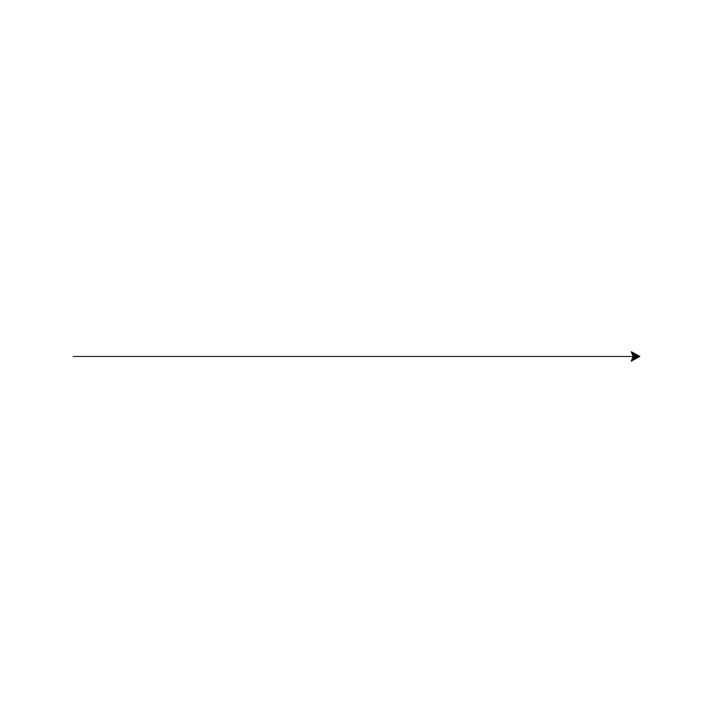

# Turtle-Fractals
This program generates fractals using a grammar system developed in 1968 by Aristid Lindenmayer called the Lindenmayer system (L-system), and displays them on the screen using turtle graphics.

## L-Systems
L-systems are a type of formal grammar that expand a string using a set of production rules. Their recursive nature leads to self-similarity in the string, which is key to generating fractals.

An L-system is described by three features:
1. **Alphabet** - defines the set of valid symbols in the system and the function each symbol represents.
2. **Axiom** - the initial state of the system represented by a string on which production rules are recursively applied.
3. **Production Rules** - defines how each symbol is replaced on each recursive iteration.

We can then define how many iterations to apply the production rules for to generate a self-similar string. 

## Drawing Fractals
The fractals on the screen are drawn using turtle graphics. This can be imagined by a turtle that starts in the center of the screen facing right. The turtle can only move forward and turn clockwise or counterclockwise. To control these movements, we can change the parameters of `unit`, which defines how many pixels the turtle moves forward each time, and `angle`, which defines how many degrees the turtle rotates when it turns.

To translate a string generated by an L-system into a fractal that the turtle can draw, we let each symbol in the alphabet of the L-system represents a command that the turtle can perform. There are currently six commands the turtle can execute:

Function | Meaning
---------|--------
DRAW | Move forward 1 `unit` and draw a line
MOVE | Move forward 1 `unit` without drawing a line
RIGHT | Turn clockwise `angle` degrees
LEFT | Turn counterclockwise `angle` degrees
SAVE POS | Save the current location to a stack
LOAD POS | Move to the last saved location and pop the stack

## Koch Curve
The following L-system generartes the Koch Curve fractal:

**Alphabet:** F L R  
**Axiom:** F  
**Angle:** 60&#176;  
**Production Rules:**

Charcter | Production Rule | Function
:-------:|-----------------|---------
F | F L F R R F L F | DRAW
L | L | LEFT
R | R | RIGHT

Expanding the axiom using the production rules produces the following set of exponentially growing strings:

Iteration | String
:--------:|---------
0 | F
1 | F L F R R F L F
2 | F L F R R F L F L F L F R R F L F R R F L F R R F L F L F L F R R F L F
3 | F L F R R F L F L F L F R R F L F R R F L F R R F L F L F L F R R F L F L F L F R R F L F L F L F R R F L F R R F L F R R F L F L F L F R R F L F R R F L F R R F L F L F L F R R F L F R R F L F R R F L F L F L F R R F L F L F L F R R F L F L F L F R R F L F R R F L F R R F L F L F L F R R F L F

